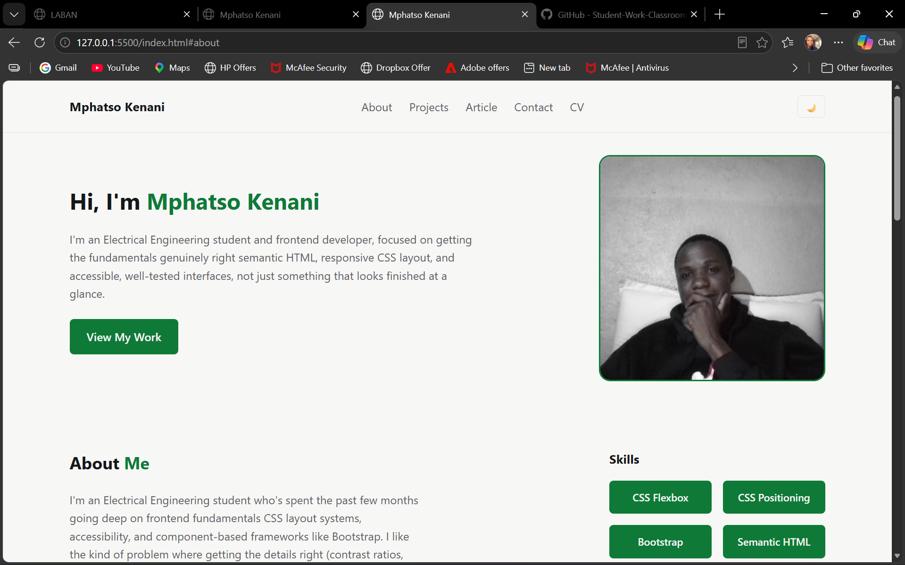

# Mphatso Kenani (Portfolio)
 * **BECE/21/SS/009**

Personal portfolio site built for the Internet and Web Services (ELE-IWS-521)
course at MUBAS. Semantic HTML, responsive CSS with a light/dark theme
system, and vanilla JavaScript,  including a live GitHub API integration,
custom form validation, and a mobile navigation toggle.

**Live site:** https://kenani40.github.io/iws-portfolio/

**Figma file:** https://www.figma.com/design/OD55x6X5bznLgdA1jkgYJu/myPortfolio?node-id=0-1&t=8symEVOvYGfej5XX-1

## Screenshot




## Features

- Semantic HTML throughout: `header`, `nav`, `main`, `section`, `article`,
  `footer`, no generic `div`s doing structural work
- Light/dark theme toggle, persisted via `localStorage`, respects OS-level
  `prefers-color-scheme` on first visit
- Fully responsive, mobile-first CSS with breakpoints at 768px, 1024px,
  and 1440px
- All colours defined as CSS custom properties, verified against WCAG AA
  contrast requirements
- Custom contact form validation with accessible error messages (no
  reliance on the browser's default validation UI)
- Live GitHub API integration: fetches and displays recent repositories
  via `fetch`/`async`/`await`, with loading and error states handled
- Custom 404 page
- Long-form article on `box-sizing: border-box`

## Running locally

This is a static site, no build step or dependencies required.

1. Clone the repo:
   ```bash
   git clone https://github.com/kenani40/iws-portfolio.git
   cd iws-portfolio
   ```
2. Open `index.html` directly in a browser, or serve it locally with any
   static server, e.g. the VS Code Live Server extension, or:
   ```bash
   python3 -m http.server 5500
   ```
   then visit `http://localhost:5500`.

## Project structure

```
iws-portfolio/
├── index.html
├── article.html
├── 404.html
├── cv.pdf
├── css/
│   └── style.css
├── js/
│   ├── theme.js
│   ├── nav.js
│   ├── form.js
│   └── github.js
├── assets/
│   └── (images)
├── DECISIONS.md
├── AI-NOTES.md
└── design-notes.md
```

## Documentation

- [`design-notes.md`](./design-notes.md): persona, sitemap, content plan,
  and design system
- [`DECISIONS.md`](./DECISIONS.md): decision log
- [`AI-NOTES.md`](./AI-NOTES.md): AI tool usage disclosure

## Lighthouse Scores

| | Performance | Accessibility | Best Practices | SEO |
|---|---|---|---|---|
| Mobile | 87 | 100 | 100 | 100 |
| Desktop | 98 | 100 | 100 | 100 |


## W3C validator
 ```bash
 https://kenani40.github.io/iws-portfolio/
 ```


```bash
https://kenani40.github.io/iws-portfolio/404.html
 ```


```bash
https://kenani40.github.io/iws-portfolio/article.html
 ```


## Credits

All photography and project screenshots are my own. Typeface is
[Inter](https://fonts.google.com/specimen/Inter), loaded via Google Fonts.
No third-party icon libraries or JavaScript frameworks are used.